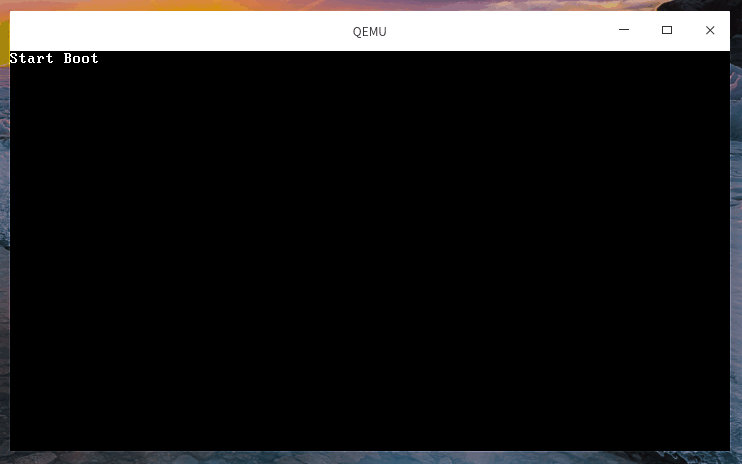

# 构建引导程序
1. 创建1.44M的软盘: `dd if=/dev/zero of=floppy.img bs=1024 count=1440`
1. 编译boot即引导程序:

    - as: `as -o boot.o boot.asm && ld -Ttext 0x7c00 --oformat=binary boot.o -o boot.bin` # 0x7c00是由ld指定, 而不是像nasm那样用`.org`指定
    - nasm: `nasm -f bin boot_nasm.asm -o boot.bin`
1. 将boot.bin写入引导扇区: `dd if=boot.bin of=floppy.img bs=512 count=1 conv=notrunc`, `conv`允许在写入数据后不截断(即改变)输出文件的大小.
1. 让qemu从软盘启动: `qemu-system-x86_64 -fda floppy.img`

## qemu调试boot.bin
1. `qemu-system-x86_64 -fda floppy.img -S -s -monitor tcp::4444,server,nowait -M q35 -cpu Skylake-Client-v1`
1. 启动gdb

    1. 输入`gdb -q`
    1. 连接gdb server: `target remote :1234`
    1. 设置被调试环境架构: `set architecture i386:x86-64:intel`, 可直接输入`set architecture`查询可得
    1. 查看cpu初始的寄存器状态: `info reg`
    1. 显示将要执行的汇编指令地址: `display /5i $cs * 0x10 + $pc`
    1. 打断点调试: `b *0x7c00`, `*addr`表示在该地址设置断点
    1. 反汇编: `disassemble 0x7c00,0x7e00` # 有问题, 参考FAQ#qemu-system-x86_64+gdb `disassemble 0x7c00,0x7e00`的结果错误, 因此暂时使用bochs调试boot.

        ```asm
        (gdb) set disassembly-flavor intel
        (gdb) disassemble 0x7c00,+100
        Dump of assembler code from 0x7c00 to 0x7c64:
        => 0x0000000000007c00:	mov    eax,cs
        0x0000000000007c02:	mov    ds,eax
        0x0000000000007c04:	mov    es,eax
        0x0000000000007c06:	mov    ss,eax
        0x0000000000007c08:	mov    esp,0xb87c00 ; 当前在实模式下,地址是16bit, 因此不用管高位的内容
        0x0000000000007c0d:	(bad)  ; 出现指令解析错误, 说明机器的arch未设置正确, 这里是16bit指令被当做32bit解析导致
        0x0000000000007c0e:	mov    ebx,0xb90700
        0x0000000000007c13:	add    BYTE PTR [rdx+0x10cd184f],bh
        0x0000000000007c19:	mov    eax,0xbb0200
        0x0000000000007c1e:	add    BYTE PTR [rdx+0x10cd0000],bh
        0x0000000000007c24:	mov    eax,0xfbb1301
        0x0000000000007c29:	add    BYTE PTR [rdx+0xab90000],bh
        0x0000000000007c2f:	add    BYTE PTR [rax-0x74],dl
        0x0000000000007c32:	fmul   DWORD PTR [rsi+0x43bd58c0]
        0x0000000000007c38:	jl     0x7c07
        0x0000000000007c3a:	adc    BYTE PTR [rax],dh
        0x0000000000007c3c:	in     al,0x30
        0x0000000000007c3e:	ror    ch,cl
        0x0000000000007c40:	adc    ebp,ebx
        0x0000000000007c42:	(bad)  
        0x0000000000007c43:	push   rbx
        0x0000000000007c44:	je     0x7ca7
        0x0000000000007c46:	jb     0x7cbc
        0x0000000000007c48:	and    BYTE PTR [rdx+0x6f],al
        0x0000000000007c4b:	outs   dx,DWORD PTR ds:[rsi]
        0x0000000000007c4c:	je     0x7c4e
        0x0000000000007c4e:	add    BYTE PTR [rax],al
        0x0000000000007c50:	add    BYTE PTR [rax],al
        0x0000000000007c52:	add    BYTE PTR [rax],al
        0x0000000000007c54:	add    BYTE PTR [rax],al
        0x0000000000007c56:	add    BYTE PTR [rax],al
        0x0000000000007c58:	add    BYTE PTR [rax],al
        0x0000000000007c5a:	add    BYTE PTR [rax],al
        0x0000000000007c5c:	add    BYTE PTR [rax],al
        0x0000000000007c5e:	add    BYTE PTR [rax],al
        0x0000000000007c60:	add    BYTE PTR [rax],al
        0x0000000000007c62:	add    BYTE PTR [rax],al
        ...
        ```
    1. 查看mbr结束位置: `x /512xb 0x7c00`, 结尾出现`0x55aa`

    或使用gdb的:
    ```bash
    $ gdb -ex 'target remote :1234' \
    -ex 'set arch i386:x86-64:intel' \
    -ex 'break *0x7c00' \
    -ex 'continue' \
    -ex 'x/3i $pc'
    ```


## 其他
- 查看boot.bin: `hexdump -C boot.bin`
- 反汇编boot.bin: 

    - as: `objdump -m i8086 -b binary -D  boot.bin` // `-d`仅反汇编特定section, 这里必须用`-D`反汇编所有section
    - nasm: `ndisasm -o 0x7c00 boot.bin`, 因为没有elf header, 因此不能使用objdump. `-o`即origin
    
    ga只能反汇编`.o`: `objdump -m i8086 -d boot.o` # objdump需指定m参数, 此时`lea	bp,	StartBootMessage`=`8d 2e 00 00             lea    0x0,%bp`还未设置偏移



## FAQ
### No executable has been specified and target does not support determining executable automatically.  Try using the "file" command. 0x0000fff0 in ?? ()
gdb执行`target remote :1234`时报错, 且`info reg`读到的qemu寄存器与qemu monitor读到的不一致. 

解决方法: 升级到`5.0.0`, 还是会报该错, 但gdb和qemu monitor读到的寄存器已一致. 原因是[gdb和qemu没有协商成正确的mode(16-bit)](https://weinholt.se/articles/debugging-boot-sectors/), 参考FAQ#qemu-system-x86_64+gdb `disassemble 0x7c00,0x7e00`的结果错误.
### qemu-system-x86_64+gdb `disassemble 0x7c00,0x7e00`的结果错误
参考:
- [qemu 2.0与gdb连接调试内核时出现"Remote 'g' packet reply is too long"问题分析](https://bbs.pediy.com/thread-255296.htm)
- [qemu+gdb调试内核出现remote ‘g’ packet reply is too long](http://www.mamicode.com/info-detail-2862637.html)

qemu与gdb协商的arch结果是`i386:x86-64(32 bit)`, 而当前代码运行在实模式下(`16 bit`), 因此反汇编的结果会出错, 可参考[这里](https://stackoverflow.com/questions/32955887/how-to-disassemble-16-bit-x86-boot-sector-code-in-gdb-with-x-i-pc-it-gets-tr).

`qemu-system-x86_64`此时也无法在gdb中设置`set arch i8086`, 报:
```
warning: Selected architecture i8086 is not compatible with reported target architecture i386:x86-64
warning: A handler for the OS ABI "GNU/Linux" is not built into this configuration
of GDB.  Attempting to continue with the default i8086 settings.

Architecture `i8086' not recognized. # 这句是关键
The target architecture is set automatically (currently i386:x86-64)
```

`qemu-system-i386`可以`set arch i8086`, 但反汇编还算错误.

其他尝试, 先执行`set arch i8086`, 再执行`target remote`会碰到`Remote 'g' packet reply is too long`.

其他地方也有该错误信息
- [Bug 22869 - set architecture i8068 has no effect on disassembly, 未解决](https://sourceware.org/bugzilla/show_bug.cgi?id=22869).
- [qemu issue : qemu-system-x86_64+gdb: unable to correctly disassemble "real mode" (i8086) instructions after attaching to QEMU started with "-S -s" options](https://bugs.launchpad.net/qemu/+bug/1686170)

也试过[Remote debugging of real mode code with gdb](https://ternet.fr/gdb_real_mode.html)提供的`gdb_init_real_mode.txt`, 同样不行.

已测试`qemu-system-x86_64`和`qemu-system-i386`的[gdb_init_real_mode.txt](https://github.com/mhugo/gdb_init_real_mode/blob/master/gdbinit_real_mode.txt)和[target.xml](https://gist.githubusercontent.com/MatanShahar/1441433e19637cf1bb46b1aa38a90815/raw/2687fb5daf60cf6aa8435efc8450d89f1ccf2205/target.xml)方法:
1. deepin 15.11 x86_64

    - qemu: QEMU emulator version 4.2.94 // qemu 5.0.0-rc4
    - gdb: GNU gdb (Debian 7.12-6) 7.12.0.20161007-git
1. ubuntu 20.04

    - qemu: QEMU emulator version 4.2.0 (Debian 1:4.2-3ubuntu6)
    - gdb: GNU gdb (Ubuntu 9.1-0ubuntu1) 9.1

都存在同样的问题, 暂无法解决. 因此推荐使用bochs调试boot.

[找到该问题的其他解释](http://www.yonch.com/tech/84-debugging-the-linux-kernel-with-qemu-and-eclipse):
```
Note that other tutorials also add a “-S” parameter so QEMU starts the kernel stopped, however this is ommitted deliberately. The “-S” parameter would allow gdb to set an initial breakpoint anywhere in the kernel before kernel execution begins. Unfortunately, a change made to the gdbserver in QEMU, to support debugging 32- and 16-bit guest code in an x86_64 session breaks the -S functionality. The symptoms are that gdb prints out “Remote ‘g’ packet reply is too long:”, and fails to interact successfully with QEMU. The suggested fix is to run the QEMU until it is in 64-bit code (i.e. after the boot loader has finished and the kernel started) before connecting from gdb (omitting the -S parameter). To debug a running kernel, this is sufficient; it is the method we will take.

# 简单翻译: 对QEMU中的gdbserver进行的更改（以支持在x86_64会话中调试32位和16位guest代码）破坏了-S功能, 因此用gdb调试16-bit就是无解了, 还是乖乖使用bochs.
```

## bochs
**bochs最大的优点是可直接在其终端控制台上调试, 比qemu+gdb方便, 且寄存器显示的是64-bit**

参考:
- [用bochs调试自己写的系统引导代码](用bochs调试自己写的系统引导代码)

```
$ sudo apt install bochs bochs-x bochsbios vgabios # bochs-x要安装，否则启动模拟器时会报错: `>>PANIC<< dlopen failed for module 'x': file not found`，因为没有xwindows组件，无法显示图像
$ vim bochsrc.txt # 创建bochs的配置文件, 参考[操作系统制作（0）bochs使用及img引导启动软盘制作](https://blog.csdn.net/qq_42138566/article/details/99005925)
$ bochs -f bochsrx.txt # 使用指定配置启动模拟器(**其工具栏打`X`的ico表示该设备还未启用**), 当前terminal会变成它的控制台终端
<bochs:10> u 0x7c00 0x7e00 # 反汇编mbr所在内存
```

> bochs 2.6.11 的bios,vgabios要单独安装否则会报`couldn't open ROM image file '/usr/share/bochs/${BIOS-bochs|VGABIOS-lgpl}-latest'`, bochs 2.6则不需要.

bochs控制台命令:
- h : 查看命令的help
- c : 继续执行, 直到遇到断点. bochs刚启动只完成了硬件平台的初始化(与`qemu -S`的效果相同)后就停止了, 必须手动继续执行
- exit : 退出模拟, bochs打开的模拟器窗口无法直接关闭, 必须要通过控制台退出
- b address :	在某物理地址上设置断点, 比如`b 0x7c00`
- s 	: 单步执行
- dump_cpu : 显示CPU中的所有寄存器和状态值
- info : 查看信息

    - cpu : cpu的寄存器
    - r/reg/regs/registers : 列表显示CPU寄存器及其内容
    - sreg : 列出CPU全部状态信息，包括各个段选择子（cs，ds等）以及ldtr和gdtr等
    - creg : 列出所有的CR0-CR4寄存器
    - tab : 页表
    - gdt
    - symbols
- xp /nuf addr : 查看内存物理地址内容 	xp /10bx 0x100000
- x /nuf addr :	查看线性地址内容 	x /40wd 0x90000; x /10bx ds:0x1a
- u start end : 反汇编一段内存 	u 0x100000 0x100010; `u /10`, 反汇编从当前地址开始的10条指令
- print-stack : 显示当前堆栈的内容

> `/nuf`类似于gdb中的格式: n 为显示的单元个数； u 为显示单元的大小（b：Byte、h：Word、w：DWord、g：QWrod（四字节））； f 为显示的格式（x：十六进制、d：十进制、t：二进制、c：字符）