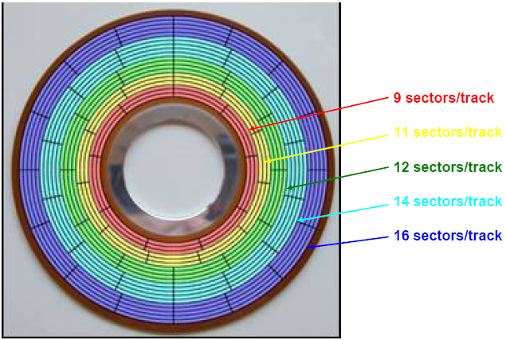

# loader
## 基础知识
参考:
- [读取磁盘：CHS方式](https://www.cnblogs.com/mlzrq/p/10223053.html)
- [直接读一个软盘扇区](https://my.oschina.net/u/580100/blog/526788)
- [<<微型计算机原理与接口技术>>]

1. LBA与CHS
硬盘的寻址方式主要有两种：
- CHS 寻址方式：由柱面数（Cylinders）、磁头数（Headers）、扇区数（Sectors）组成 3D 参数，简称 CHS 寻址方式，硬盘容量相对较小. 如传统的机械硬盘（Hard Disk Drive，HDD）, 软盘.

    相关概念:
    1. 磁头（head）数：每个盘片一般有上下两面，分别对应1个磁头，共2个磁头
    1. 磁道（track）数：位于同一个同心圆上的扇区组成的圆环, 磁道是从盘片外圈往内圈编号0磁道，1磁道...，靠近主轴的同心圆用于停靠磁头，不存储数据
    1. 柱面（cylinder）数：所有盘片中半径相同的同心磁道构成的柱面.
    1. 扇区（sector）数：每个Track可以进一步划分为多个小的区域, 是磁盘上最小的I/O单元，一般为512 byte.

        - 旧时的小容量硬盘每个Disc上每个Track都划分为等量的Sector，便于数据读取
        - 每个Track等量的Sector分配对位于Disc外部的Track非常浪费，所以现代大容量磁盘采用了一种新的划分Sector的方法，即ZBR. ZBR将磁盘不同的Track划分为多个Zone，同一Zone的Track具有等量的Sector. 位于Disc外侧Zone的Track划分的Sector数量要比内侧的Zone的Track多. ZBR环境下不能使用CHS方式寻址数据了，所以引入了一种新的寻址模式，也就是LBA.

        一个扇区有两个主要部分：存储数据地点的标识符和存储数据的数据段:
        1. 扇区的第一个主要部分是标识符. 标识符，就是扇区头标，包括组成扇区三维地址的三个数字：扇区所在的磁头（或盘面）、磁道（或柱面号）以及扇区在磁道上的位置即扇区号. 头标中还包括一个字段，其中有显示扇区是否能可靠存储数据，或者是否已发现某个故障因而不宜使用的标记. 有些硬盘控制器在扇区头标中 还记录有指示字，可在原扇区出错时指引磁盘转到替换扇区或磁道. 最后，扇区头标以循环冗余校验（CRC）值作为结束，以供控制器检验扇区头标的读出情况， 确保准确无误.
　　     1. 扇区的第二个主要部分是存储数据的数据段，可分为数据和保护数据的纠错码（ECC）.
    1. Cluster(簇): 通常一个数据文件至少要占用连续的几个Sector，如果每次读写操作都需要定位到最小的Sector单位，那速度将会非常慢. 因此cluster是操作系统用于优化I/O读写速度创建的，它是逻辑上的一组Sector，每个Cluster一般会覆盖4-64个Sector（2-32KB）.
    1. 圆盘（platter）数：盘片的数量

    **硬盘磁道, 扇区, 柱面的划分, 扇区设置(比如扇区头标), 坏道/扇区标记等均在磁盘低级格式化时完成**.
    CHS的BIOS规范只有24位元: 磁柱10b、磁头8b、磁区6b, 定义在BIOS的INT 13H软体中断里.
- LBA 寻址方式：**线性寻址**，以逻辑区块为单位进行寻址，全称为 Logic Block Address（即扇区的逻辑块地址），硬盘容量相对较大, 如固态硬盘（Solid State Disk，SSD）.

    LBA作为一种新的寻址方式，机械磁盘Controller会负责将LBA (physical geometry) 翻译为 CHS addressing (logical geometry) 供操作系统和BIOS使用.

    LBA采用48个bit位寻址，最大寻址空间128PB.

CHS Capacity = Cylinders × Heads × Sectors × sector_size, 即CHS寻址方式的容量由CHS三个参数决定：
- 磁头数, 从0开始编号
- 柱面数, 从0开始编号
- 扇区数, 从1始编号

LBA=`(C-CS)*PH*PS + (H-HS)*PS + (S-SS)`, 其中CS表示起始柱面号，HS表示起始磁头号，SS表示起始扇区号，PS表示每磁道扇区数，PH表示每柱面磁道数(即磁头数)，C为当前柱面号, H为当前磁道号, S为当前扇区号, 代入CHS参数(CS=0，HS=0，SS=1), 因此LBA=`C﹡PH﹡PS + H*PS + S-1`.

因此:
- C = LBA/(PH*PS), 即LBA/一个柱面的扇区数
- H =(LBA/PS)%PH, 即(LBA/PS, 总磁道数)/%PH
- S = LBA%PS+1, 即LBA%一个磁道的扇区数, 多出来的就是S

代入3.5英寸软盘的PS=18, PH=2:
- C = LBA/36
- H = (LBA/18)%2
- S = LBA%18 + 1

3.5英寸软盘容量 = 80柱面 * 2磁头 * 18扇区 * 512B(每个扇区) = 1440KB ≈ 1.44MB




> 通常机械硬盘的标签上有标明LBA与CHS.

> 在实模式下，访问ATA硬盘有两种方法: 调用BIOS INT 13中断和直接用IN/OUT指令读写相应端口.

## 构建测试用的fat12 img
参考:
- [实现一个简单的64位操作系统 (0x03)FAT12文件系统](https://zhuanlan.zhihu.com/p/43296291)

直接通过汇编写fat12有些不直观, 而通过使用[C语言对FAT12的镜像文件进行解析](parse_fat12.c)，能够熟悉FAT12文件系统，同时，之后的loader实现只需要将C实现人工“翻译”成汇编即可.


构建fat12:
1. dd if=/dev/zero bs=1024 count=1440 of=fat12_demo.img
1. mkfs.fat -F 12 fat12_demo.img
1. write data:
    ```bash
    # mkdir /mnt/img
    # mount fat12_demo.img /mnt/img
    # cd /mnt/img
    # echo "hello fat12" > readme.txt
    # ls
    readme.txt*
    # mkdir dir
    # cd dir
    # echo "this is a file @ /dir" > secend.md
    # cd ..
    # tree
    .
    ├── dir
    │   └── secend.md
    └── readme.txt

    1 directory, 2 files
    # umount /mnt/img
    ```